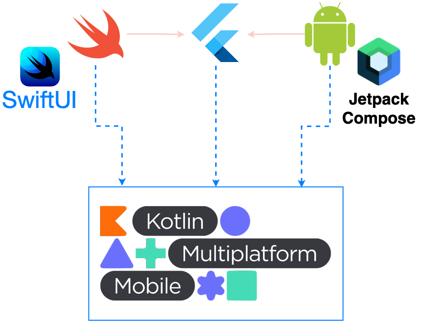

# Megazord Pokemon Mobile

## Aplicativo Mobile com Jetpack Compose, SwiftUI e Flutter

Aplicação de testes com o objetivo de validar a implementação conjunta dos principais frameworks mobile no momento.

## Componentes

As telas do aplicativo estão construídas em três tecnologias diferentes:
* Tela Principal (SwiftUI / Android Jetpack Compose)
* Tela de Listagem (Flutter)

Em cada uma das telas existem chamadas de serviços que são compartilhadas em uma camada única entre as duas plataformas, em um módulo KMM.

## Principal Motivação

Testar se era possível. TL;DR : Sim, é possível.

## Decisões de Projeto e Padrões Seguidos

À princípio as decisões foram no sentido de deixar toda a estrutura funcional.

Inclusive não foram seguidos os padrões recomendados para KMM, uma vez que eles forçam dos projetos Android (app) e KMM (módulo compartilhado) ficarem juntos em um mesmo projeto físico, gradle.