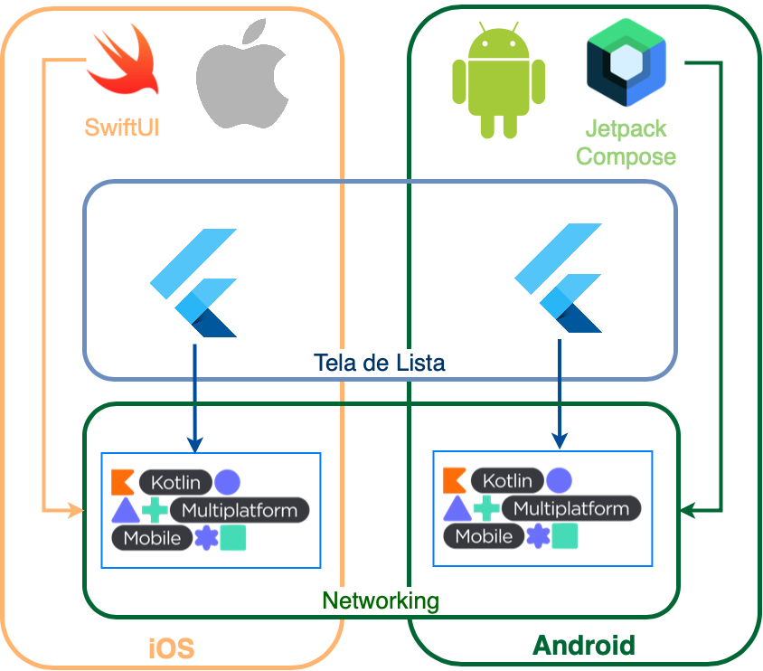

# Megazord Pokemon Mobile

## Aplicativo Mobile com Jetpack Compose, SwiftUI e Flutter

Aplicação de testes com o objetivo de validar a implementação conjunta dos principais frameworks mobile no momento.

## Componentes

As telas do aplicativo estão construídas em três tecnologias diferentes:
* Tela Principal (SwiftUI / Android Jetpack Compose)
* Tela de Listagem (Flutter)

Em cada uma das telas existem chamadas de serviços que são compartilhadas em uma camada única entre as duas plataformas, em um módulo KMM.



## Requisitos de Sistema

Por estarem sendo usadas funcionalidades ainda em Alpha/Beta, são necessárias ferramentas em Preview, além de algumas stable:

* Xcode 13 Beta
* Android Studio Preview - Artic Fox
* Flutter 2.2.0

## Setup Inicial

Como não foram (ainda) incluídos builds automáticos das dependências, após clonar o repositório execute os seguites comandos.

1. Na pasta Megazord_Poke_Flutter
```
flutter build ios-framework --cocoapods --xcframework --no-universal --no-profile --no-release
flutter build aar
```

2. Na pasta Megazord_Poke_KMM

```
./gradlew assembleDebug
```

Com os artefatos gerados, os aplicativos iOS e Android podem ser executados normalmente.

## Principal Motivação

Testar se era possível. TL;DR : Sim, é possível.

## Decisões de Projeto e Padrões Seguidos

À princípio as decisões foram no sentido de deixar toda a estrutura funcional.

Inclusive não foram seguidos os padrões recomendados para KMM, uma vez que eles forçam dos projetos Android (app) e KMM (módulo compartilhado) ficarem juntos em um mesmo projeto físico, gradle.


